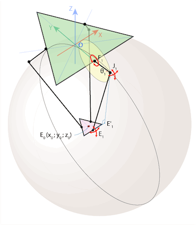
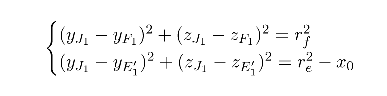
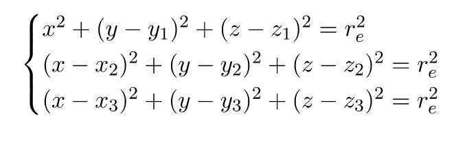
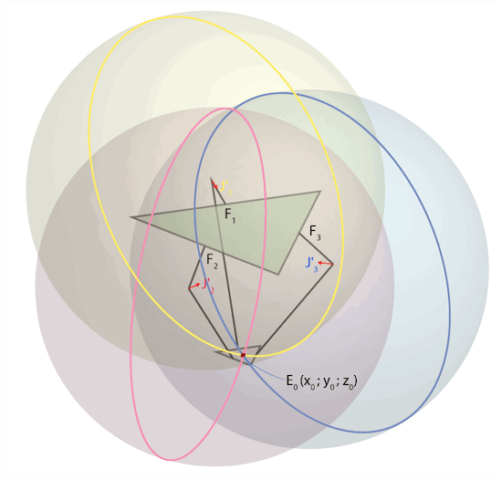
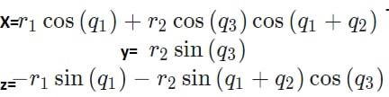
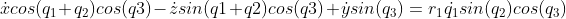
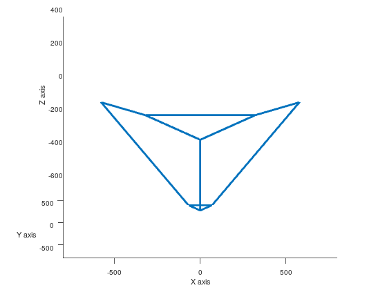
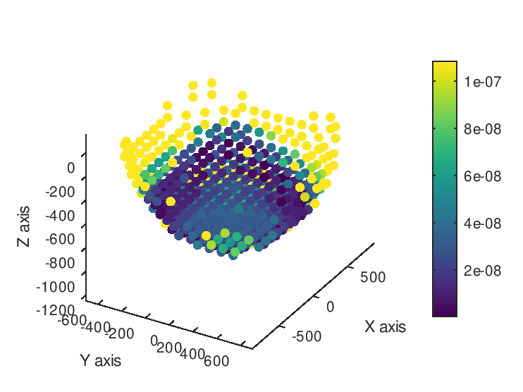

# Kinematics of ABB IRB 360 parallel delta robot

## Robot model

It is a parallel robot with 3 active joints and 6 passive joints.
Each chain has 2 links and connected to the mobile platform.

We assumed following robot dimensions:
```
base_radius = 370;
bicep_length = 300;
forearm_length = 800;
end_platform_radius = 80;
```



Inverse kinematics is solved by finding the 2 circles intersection point. \
Forward kinematics is solved by finding the 3 spheres intersection point.

Equations and schematic image source: [https://habr.com/ru/post/390281/](https://habr.com/ru/post/390281/)

## Inverse kinematics

The main task in IK is to find the coordinates of J<sub>1</sub> point.
We do it by solving the system of equations.



r<sub>f</sub> is a bicep length, r<sub>e</sub> is a forearm length

## Forward kinematics

The main task in forward kinematics is to find the position of the mobile platform, given active joint angles. We solve by finding the 3 spheres intersection point. Here is the used system of equations.





All derivations are described in [this article](https://habr.com/ru/post/390281/).

## Jacobian

Derivation of the jacobian is built on this equations:



Then derivatives of equations with respect to x, y and z are found. Then we multiply equations with trigonometrical functions, add them together, which results in some terms elimination. Finally we obtained the following equation:



Here is an example that we recorded for test the jacobian.


## Singularity map

Singularity analyses were based on Jacobian analysis in specific end-effector position and orientation, using the formula for manipulability index.



Map shows that singularities are observed at the edges of the working area of the robot.

## How to run

The gif of moving robot (position is calculated with jacobian) can be obtained by running Matlab/Octave script

```run(hw5_jacobian_animation.m)```

It will generate the file `jacobian_moving.gif`

To build the singularity map:

```run(hw5_singularity_map.m)```

Figure will be saved into the `singularity_map.gif`.